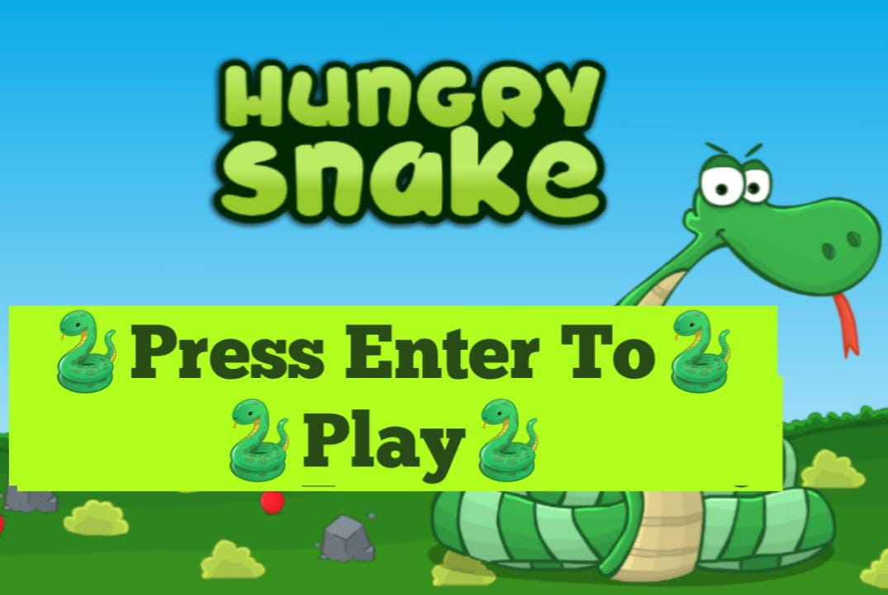

# Snake Game 🐍

<p align="center">
    
</p>

## About the Game
This is a classic **Snake Game** built with Python and Pygame. Navigate the snake to eat food, grow in length, and aim for the highest score. But beware of collisions with the walls or your own body!

---

## 🎮 Features
- **Interactive Gameplay**:
  - Use arrow keys to control the snake.
  - Eat food to increase the snake's length and your score.
- **High Score Tracking**:
  - Stores the highest score in a file (`highscore.txt`).
- **Music Integration**:
  - Background music during gameplay.
  - Unique music on the Game Over screen.
- **Game Screens**:
  - Welcome screen with an option to start the game.
  - Game Over screen displaying the score and high score.


---

## 🛠️ How to Run the Game
1. Make sure Python 3 and Pygame are installed on your system.
2. Clone the repository or download the project files.
3. Place all required assets (`bg.jpg`, `snake.jpg`, `gameover.jpg`, `back.mp3`, `gameover.mp3`) in the same directory as the script.
4. Run the following command to start the game:
   ```bash
   python snake_game.py
